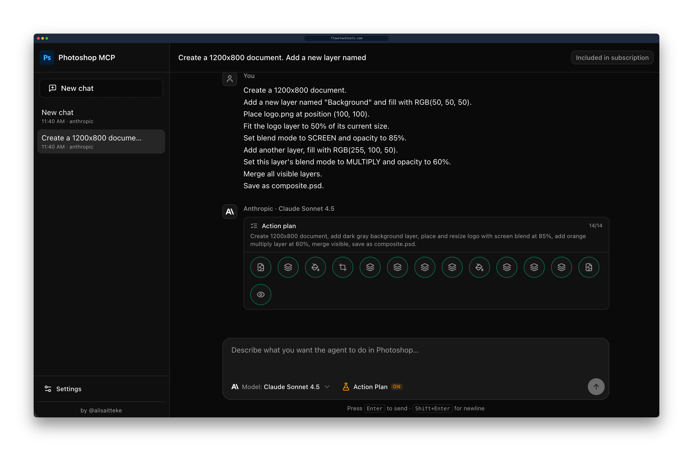

# Photoshop MCP Server

*v1.1+ — recipe workflows, fewer round-trips, snappier sessions. Standalone UI ships **Action Plan (beta)** for plan-then-execute runs.*

> **Note:** This is an unofficial, community-maintained project and is not affiliated with or endorsed by Adobe Inc.

[](https://www.npmjs.com/package/@alisaitteke/photoshop-mcp)
[](https://github.com/alisaitteke/photoshop-mcp/releases)
[](#action-plan-beta)
[](https://opensource.org/licenses/MIT)
[](https://www.typescriptlang.org/)
[]()

A Model Context Protocol (MCP) server that enables AI assistants like Claude and Cursor to control Adobe Photoshop programmatically. This allows you to create designs, manipulate images, and automate Photoshop workflows through natural language commands while working in your IDE — or through the bundled **standalone web UI**, which supports both API keys and CLI subscription accounts (Claude Code / Gemini CLI). The UI also offers an opt-in **Action Plan (beta)** mode that plans every Photoshop step in one LLM call, then runs them in a single pass.

## 🖥️ Standalone UI (no IDE required)

Don't want to wire this into Claude Desktop or Cursor? The same package ships a
fully local web UI that lets you chat with an AI model and drive Photoshop
through this MCP server underneath. Connect with a provider API key **or**, for
Anthropic and Google, reuse the OAuth session from **Claude Code** or **Gemini
CLI** — no separate API key required.



```bash
npx -p @alisaitteke/photoshop-mcp photoshop-mcp-ui
```

That's it. A local server starts on `127.0.0.1` (random free port) and your
default browser opens the chat UI automatically.

### Supported providers

Pick any of the following on first launch — use an API key **or** your existing
CLI subscription account (Anthropic and Google):

| Provider | Models | API key | CLI account |
|---|---|---|---|
| **Anthropic** | Claude Sonnet / Opus / Haiku | [console.anthropic.com](https://console.anthropic.com/settings/keys) | `npm i -g @anthropic-ai/claude-code` → `claude auth login` |
| **OpenAI** | GPT-5, GPT-4.1, o-series | [platform.openai.com](https://platform.openai.com/api-keys) | — |
| **Google** | Gemini 2.5 Pro / Flash / Flash-Lite | [aistudio.google.com](https://aistudio.google.com/apikey) | `npm i -g @google/gemini-cli` → `gemini auth login` |
| **OpenRouter** | 100+ models from any provider | [openrouter.ai](https://openrouter.ai/keys) | — |

### Authentication modes

- **`api_key` (default)** — Vercel AI SDK + your provider API key. Usage is billed
  per token at API rates; the UI shows estimated cost per chat.
- **`cli_account`** — Uses your local Claude Code or Gemini CLI OAuth session.
  No API key is stored; the UI probes `claude auth status` / `gemini` headless
  to verify login. Usage counts against your **subscription quota**, not API
  billing — the status bar shows "Included in subscription".

You can switch auth method per provider in Settings without losing the other
credential (e.g. keep an API key while trying CLI account, then switch back).

### Action Plan (beta)

An optional execution mode in the standalone web UI for **API key auth only**
(`cli_account` always uses the default agentic flow). Turn it on with the
**Action Plan** toggle next to the model selector in the composer.

Instead of a per-step ReAct loop (model → tool → model → tool …), Action Plan:

1. Makes **one** planning LLM call that outputs an ordered todo list of
   Photoshop MCP tool calls with parameters.
2. Executes those tools **directly** in sequence — no extra model round-trips
   between steps.
3. On a failed step or unresolved dependency, runs a bounded **repair** loop
   (re-plans only the remaining steps, up to 3 times).

The plan appears as a live todo list above the tool-call cards, with per-step
status (`pending` → `running` → `done` / `error`). Plans are persisted in chat
history so they survive reload. The toggle is off by default; the existing
agentic flow is unchanged when Action Plan is disabled.

Good for multi-step prompts such as *"remove the background and export for web"*
where you want fewer model calls and faster end-to-end execution.

### What happens on first launch

1. Pick a provider and choose **API key** or **Uses your account**.
2. Validate the key or check the CLI connection. Config is stored locally at
   `~/.photoshop-mcp/data.db` (SQLite, `chmod 600`). API keys never leave your
   machine; CLI mode inherits OAuth from `~/.claude/` or `~/.gemini/`.
3. Type natural-language prompts. The UI streams the model's reply, runs
   Photoshop tool calls in real time, and renders each tool call as an
   inspectable card (input + result).
4. Switch provider, auth method, or model anytime from Settings / model selector
   — chats, costs and tool history are persisted across sessions.

### Switching auth method later

Open **Settings** from the sidebar at any time:

| Action | API key mode | CLI account mode |
|---|---|---|
| Set up | Paste key → **Save** | Install CLI → `auth login` → **Check connection** |
| Switch away | Choose **API key** — stored key is kept | Choose **Uses your account** — key is not deleted |
| Custom binary | — | Optional **CLI path** if `claude` / `gemini` is not on `PATH` |
| Cost display | Per-token estimate in status bar | **Included in subscription** badge |

Auth method is stored per provider in `~/.photoshop-mcp/data.db` (`authMethod`:
`api_key` or `cli_account`). Existing configs without `authMethod` default to
`api_key` and keep working unchanged.

### CLI flags

```
photoshop-mcp-ui [--port 5174] [--host 127.0.0.1] [--no-open]
```

### Notes

- The agent is restricted to Photoshop MCP tools only — built-in shell, file
  and web tools are disabled.
- Tech stack: Vue 3 + Tailwind v4 + [shadcn-vue](https://www.shadcn-vue.com/)
  on the frontend; [Hono](https://hono.dev/) on the backend. API-key mode uses
  the [Vercel AI SDK](https://sdk.vercel.ai/); CLI account mode uses the
  [Claude Agent SDK](https://code.claude.com/docs/en/agent-sdk/mcp) (Anthropic)
  or Gemini CLI headless `stream-json` (Google). All paths talk to this same
  Photoshop MCP server over STDIO.
- **CLI account limitations:** Gemini headless may open a new session each turn
  (history is prepended to the prompt). Anthropic CLI account consumes
  subscription quota. OAuth login is macOS-first (`claude auth login` /
  `gemini auth login` in Terminal).

---

## AI/Prompt Layer for Photoshop

On top of atomic `photoshop_*` tools, the server ships an opinionated AI/prompt
layer that helps host LLMs (Cursor, Claude Desktop, etc.) translate vague user
requests into reliable Photoshop actions:

- **Server `instructions`** — workflow contract advertised on MCP `initialize`
  (ping once, state-before-action, prefer recipes, error recovery). See
  [`src/prompts/instructions.ts`](src/prompts/instructions.ts).
- **MCP `prompts` primitive** — 16 pre-engineered templates (12 recipe + 4 guide:
  `ps.enhance_portrait`, `ps.remove_background`, `ps.gradient_fade`, `ps.sky_blend`, …)
  via `prompts/list` and `prompts/get`.
- **Recipe tools** — 12 outcome-oriented `photoshop_recipe_*` tools (remove
  background, enhance portrait, prepare for web, export social variants, color
  grade, frequency separation, batch mockup, organize layers, gradient fade,
  sky blend, dodge & burn, remove distraction). Each wraps steps in a single
  Photoshop history state (one Undo reverts all). **80 tools total** (68 atomic
  + 12 recipe).
- **State & preview** — `photoshop_get_state` (cheap snapshot),
  `photoshop_get_preview` (base64 JPEG for vision verification),
  `photoshop_get_capabilities` (version-aware feature flags).
- **Structured errors** — failures return JSON envelopes with `code` and
  `suggested_next_tool` for self-correction.

Full reference: [`docs/prompt-layer.md`](docs/prompt-layer.md).

Verify parity: `npm run verify:photoshop-prompts`. Latest results:
[`docs/development.md#integration-test-results`](docs/development.md#integration-test-results).

## Example Prompts

Below are example prompts you can use with AI assistants (Claude, Cursor, etc.)
when this MCP server is configured. Prefer **recipe tools** (`photoshop_recipe_*`)
for multi-step outcomes — each recipe is a single undo step. Use atomic
`photoshop_*` tools only for fine-grained edits no recipe covers.

<details>
<summary>🧠 State-aware session (recommended first step)</summary>

```
Ping Photoshop and read capabilities for my installed version.
Get the current document state before changing anything.
Open portrait.jpg, get a downscaled preview so you can verify the subject.
After each major recipe, get another preview to confirm the result.
```

</details>

<details>
<summary>👤 Portrait retouch (recipe)</summary>

```
Enhance the portrait on the active layer at medium intensity with skin smoothing.
Use the enhance-portrait recipe — I want frequency separation + auto-tone in one undoable step.
If the active layer is text or a Smart Object, rasterize first or pick a raster layer.
Show me a preview when done.
```

Equivalent MCP prompt template: `ps.enhance_portrait` with `{ intensity: "medium", skin_smoothing: "true" }`.

</details>

<details>
<summary>✂️ Background removal (recipe)</summary>

```
Remove the background from the active portrait layer.
Use Select Subject + a layer mask with a 2px feather. Keep the original pixels behind the mask.
The subject must be on the active layer — not a flat color fill.
```

Equivalent MCP prompt template: `ps.remove_background` with `{ feather_px: "2", keep_shadow: "false" }`.

</details>

<details>
<summary>🎨 Color grade (recipe)</summary>

```
Apply a warm film color grade to the open document as non-destructive adjustment layers.
Use the apply-color-grade recipe with preset warm_film.
Preview the result when finished.
```

</details>

<details>
<summary>🔬 Frequency separation setup (recipe)</summary>

```
Set up frequency separation on the active raster layer with a 6px blur radius.
I will paint on the Low and High layers myself — do not apply extra smoothing.
Tell me which layers to edit when the stack is ready.
```

Equivalent MCP prompt template: `ps.frequency_separation` with `{ radius_px: "6" }`.

</details>

<details>
<summary>🌐 Prepare for web + social export (recipes)</summary>

```
Prepare the active document for web: sRGB, downscale, sharpen, export one optimized JPEG to ~/.photoshop-mcp/exports.
Then export Instagram post and X post variants as separate JPEGs from the same document.
List the output paths in a table.
```

Equivalent templates: `ps.prepare_for_web`, `ps.export_social_variants`.

</details>

<details>
<summary>📦 Batch mockup replace (recipe)</summary>

```
I have a mockup PSD open with a Smart Object layer named "Screen".
Replace it with every PNG/JPG in ~/assets/mockups/ and export one JPEG per asset.
Do not place flat layers — swap the Smart Object so perspective is preserved.
```

Equivalent MCP prompt template: `ps.batch_mockup_replace`.

</details>

<details>
<summary>🗂️ Organize layers (recipe)</summary>

```
Organize the layer stack: rename by kind, auto-group related layers, preserve originals.
Run the organize-layers recipe, then list layers so I can review the new structure.
```

</details>

<details>
<summary>🎨 Basic Design Creation</summary>

```
Create a 1920x1080 Photoshop document with RGB color mode.
Add a light blue background layer and fill it with RGB(240, 248, 255).
Add centered text "Welcome" in 64pt font.
Save as welcome.psd to my Desktop.
```

</details>

<details>
<summary>🖼️ Stock Image Design (with Pexels MCP)</summary>

```
Search Pexels for "mountain sunset" images.
Create a 1920x1080 Photoshop document.
Place the downloaded image and fit it to fill the entire canvas.
Apply a subtle Gaussian blur of 3px.
Increase brightness by 15 and contrast by 10.
Add white text "Adventure Awaits" centered at the top in 72pt.
Set the text opacity to 90% and blend mode to OVERLAY.
Save as adventure.jpg with quality 10.
```

</details>

<details>
<summary>✨ Photo Enhancement</summary>

```
Open photo.jpg from my Desktop in Photoshop.
Get state, then run the enhance-portrait recipe at low intensity.
If I only need quick tone fixes, apply auto levels, auto contrast, and unsharp mask (120%, 1.5, 0) on the active layer instead.
Adjust hue +15 and saturation +15, or use prepare-for-web when I'm ready to export.
Save as enhanced-photo.jpg with quality 12.
```

</details>

<details>
<summary>🎭 Layer Effects & Blending</summary>

```
Create a 1200x800 document.
Add a new layer named "Background" and fill with RGB(50, 50, 50).
Place logo.png at position (100, 100).
Fit the logo layer to 50% of its current size.
Set blend mode to SCREEN and opacity to 85%.
Add another layer, fill with RGB(255, 100, 50).
Set this layer's blend mode to MULTIPLY and opacity to 60%.
Merge all visible layers.
Save as composite.psd.
```

</details>

<details>
<summary>📝 Text Poster Design</summary>

```
Create a 1080x1350 portrait document (Instagram story size).
Add a layer and fill with gradient-like color RGB(120, 40, 200).
Add text "SUMMER" at (540, 300) in 96pt.
Change text color to white RGB(255, 255, 255).
Set text alignment to CENTER.
Add another text "2026" at (540, 450) in 128pt, white color.
Apply Gaussian blur 2px to the background layer.
Save as summer-poster.png.
```

</details>

<details>
<summary>🎬 Batch Processing</summary>

```
Open image1.jpg.
Resize to 1920x1080.
Apply auto contrast.
Apply subtle sharpen (amount 80%, radius 1.0).
Save as processed-1.jpg with quality 10.
Close without saving changes to original.

Repeat for image2.jpg and image3.jpg.
```

</details>

<details>
<summary>🖌️ Creative Manipulation</summary>

```
Create a 2000x2000 square document.
Place abstract-pattern.jpg and fit to fill document.
Duplicate the layer.
On the duplicate, apply motion blur at 45 degrees, radius 50px.
Set blend mode to OVERLAY and opacity to 70%.
Add centered text "MOTION" in 120pt white.
Apply a rectangular selection from (200, 200) to (1800, 1800).
Invert the selection and delete (to create a border effect).
Flatten the image.
Save as motion-art.jpg.
```

</details>

<details>
<summary>🎯 Advanced Workflow</summary>

```
Create a 3000x2000 document at 300 DPI for print.
Place hero-image.jpg and fit to fill the canvas.
Duplicate the image layer.
On the duplicate, desaturate it completely.
Set blend mode to LUMINOSITY and opacity to 50%.
Create a new layer named "Overlay".
Fill with RGB(255, 150, 0) and set blend mode to SOFTLIGHT at 30% opacity.
Add text "PORTFOLIO" at top center (1500, 200) in 96pt.
Set text color to white.
Add subtext "2026 Collection" at (1500, 320) in 36pt.
Create a rectangular selection around the text area.
Create a layer mask on the overlay layer.
Merge visible layers.
Save as portfolio-cover.psd.
Export as portfolio-cover.jpg at quality 12.
```

</details>

<details>
<summary>🔄 Using Actions</summary>

```
Open my-photo.jpg.
Play the "Vintage Look" action from "My Actions" set.
Adjust brightness by -10 to darken slightly.
Save as vintage-photo.jpg.
```

</details>

<details>
<summary>⚡ Custom Script Execution</summary>

```
Execute this custom ExtendScript code:
app.beep();
alert('Processing started!');
```

</details>

<details>
<summary>⏮️ Undo/Redo Operations</summary>

```
Apply Gaussian blur 15px to the active layer.
[Wait for result]
Actually, that's too much blur. Undo that.
Apply Gaussian blur 5px instead.
```

Or:

```
Get the history states to see what operations were performed.
Undo the last 3 operations.
Redo 1 step to bring back one operation.
```

</details>

<details>
<summary>🔁 Error recovery (structured envelopes)</summary>

```
If a recipe returns version_unsupported or generative_unavailable, call get_capabilities and tell me which Photoshop feature is missing.
If a tool fails with suggested_next_tool, follow that hint (e.g. rasterize_layer before a raster-only recipe).
Never guess — read get_state after a failure and propose the next single step.
```

</details>

## Features

- **Standalone web UI** — local chat interface (`photoshop-mcp-ui`); API key or CLI
  subscription auth per provider (Anthropic, Google)
- **Action Plan (beta)** — opt-in plan-then-execute mode in the web UI (API key
  only): one planning call, direct tool execution, bounded repair on failure
- **Works on both Windows and macOS**
- **Supports Photoshop 2012-2025+**
- **ExtendScript API**: Universal compatibility via AppleScript/COM automation
- **Auto-Detection**: Automatically finds Photoshop installation on your system
- **78 Tools**: 66 atomic `photoshop_*` + 12 recipe `photoshop_recipe_*`
- **AI/Prompt Layer**: 16 MCP prompt templates (12 recipe + 4 guide), server instructions, state/preview/capabilities tools
- **Document Management**: Create, open, save, close, crop documents
- **Layer Operations**: Create, delete, duplicate, merge, transform layers
- **Layer Properties**: Opacity, blend modes, visibility, locking
- **Text Formatting**: Font, size, color, alignment controls
- **Image Placement**: Place images, open files, fit to document
- **Filters**: Gaussian Blur, Sharpen, Noise, Motion Blur
- **Color Adjustments**: Brightness/Contrast, Hue/Saturation, Curves, Auto Levels/Contrast
- **Selections & Masks**: Rectangular selections, select subject, content-aware fill, gradient mask, layer masks
- **History Control**: Undo/Redo operations, view history states
- **Actions**: Play recorded actions, execute custom scripts
- **Auto-Rasterize**: Automatically converts layers when needed for filters
- **Context Tracking**: Returns document/layer state after each operation for AI context awareness

## Installation

### Using NPX (Recommended)

No installation required! Just configure your MCP client:

```bash
npx @alisaitteke/photoshop-mcp
```

To hack on the repo locally, see [From Source](docs/development.md#from-source) in the development guide.

## Configuration

### For Cursor

Add to your Cursor settings (`.cursor/config.json` or workspace settings):

```json
{
  "mcpServers": {
    "photoshop": {
      "command": "npx",
      "args": ["-y", "@alisaitteke/photoshop-mcp"],
      "env": {
        "LOG_LEVEL": "1"
      }
    }
  }
}
```

### For Claude Desktop

Add to your Claude Desktop config (`~/Library/Application Support/Claude/claude_desktop_config.json` on macOS or `%APPDATA%\Claude\claude_desktop_config.json` on Windows):

```json
{
  "mcpServers": {
    "photoshop": {
      "command": "npx",
      "args": ["-y", "@alisaitteke/photoshop-mcp"],
      "env": {
        "LOG_LEVEL": "1"
      }
    }
  }
}
```

### Environment Variables

- `PHOTOSHOP_PATH`: (Optional) Specify custom Photoshop installation path
- `LOG_LEVEL`: Logging level (0=DEBUG, 1=INFO, 2=WARN, 3=ERROR)
- `POSTHOG_DISABLED`: Set to `1` or `true` to disable anonymous usage analytics entirely
- `POSTHOG_KEY`: (Optional) Override the PostHog project key used for analytics
- `POSTHOG_API_HOST`: (Optional) PostHog ingest host (default: `https://a.alisait.com`)
- `POSTHOG_UI_HOST`: (Optional) PostHog UI host for dashboard links (default: `https://eu.posthog.com`)

## Available Tools

Full reference for all atomic `photoshop_*` tools (parameters, examples, and usage):
[`docs/available-tools.md`](docs/available-tools.md).


## Context Tracking

Each tool returns comprehensive context information about the current state of Photoshop, including:

- **Document Info**: Name, dimensions, resolution, color mode, layer count
- **Active Layer Info**: Name, type, opacity, blend mode, visibility, lock state
- **Selection State**: Whether a selection is active
- **Operation Result**: Specific details about what was changed

This allows AI assistants to maintain awareness of:
- Which document is active
- Which layer is being worked on
- Current layer properties (opacity, blend mode, etc.)
- Document dimensions and settings

**Example Response:**
```javascript
{
  "applied": true,
  "filter": "Gaussian Blur",
  "radius": 10,
  "wasRasterized": true,
  "context": {
    "hasDocument": true,
    "document": {
      "name": "design.psd",
      "width": 1920,
      "height": 1080,
      "resolution": 72,
      "colorMode": "RGBColorMode",
      "layerCount": 3,
      "hasSelection": false
    },
    "activeLayer": {
      "name": "Background",
      "kind": "NORMAL",
      "opacity": 100,
      "blendMode": "NORMAL",
      "visible": true,
      "locked": false,
      "isBackground": false
    }
  }
}
```

This context helps AI assistants remember what document and layer they're working on across multiple commands.

---

## Platform-Specific Notes

### Windows

- Uses COM automation to communicate with Photoshop
- Registry-based auto-detection for installation paths
- Supports both 32-bit and 64-bit versions

### macOS

- Uses AppleScript/OSA for Photoshop communication
- Spotlight-based auto-detection
- Supports multiple Photoshop versions installed simultaneously
- **CLI account auth** (standalone UI) is macOS-first: run `claude auth login` /
  `gemini auth login` in Terminal; credentials live under `~/.claude/` and
  `~/.gemini/`

## Supported Photoshop Versions

- **All Photoshop versions** (2012-2025+): Uses ExtendScript API via AppleScript (macOS) or COM (Windows)

**Important Note**: While Photoshop 2022+ supports UXP for plugins, external automation via AppleScript/COM can only use ExtendScript. UXP is designed for internal plugins and cannot be invoked from external scripts. Therefore, this MCP server uses ExtendScript for maximum compatibility across all Photoshop versions.

## Troubleshooting

Common connection, scripting, and logging issues:
[`docs/troubleshooting.md`](docs/troubleshooting.md).

### Standalone UI — CLI account auth

| Symptom | Likely cause | Fix |
|---|---|---|
| `cli_not_found` | Claude Code / Gemini CLI not installed | `npm i -g @anthropic-ai/claude-code` or `npm i -g @google/gemini-cli` |
| `not_authenticated` | No OAuth session | Run `claude auth login` or `gemini auth login` in Terminal |
| `claude` / `gemini` not on `PATH` | Custom install location | Settings → **CLI path** → **Check connection** |
| Chat works in IDE but not UI (CLI mode) | OAuth tokens are CLI-only | Use **CLI account** in UI; API keys and CLI sessions are separate |
| Gemini multi-turn feels forgetful | Headless CLI may start a fresh session each turn | Known limitation; history is prepended to the prompt (MVP) |

## Development

From-source setup, build, lint, integration tests (with latest results), and usage examples:
[`docs/development.md`](docs/development.md).

## Architecture

Repository layout and module map:
[`docs/architecture.md`](docs/architecture.md).

## Contributing

Contributions are welcome! Please read [CONTRIBUTING.md](CONTRIBUTING.md) before opening a PR.

## License

MIT

## Anonymous Usage Analytics

Anonymous, aggregated usage events are collected by default to improve the
product. You can opt out at any time. Full details:
[`docs/anonymous-usage-analytics.md`](docs/anonymous-usage-analytics.md).

## Acknowledgments

- Built with the [Model Context Protocol SDK](https://github.com/modelcontextprotocol/sdk)
- Inspired by the Adobe Photoshop scripting community
