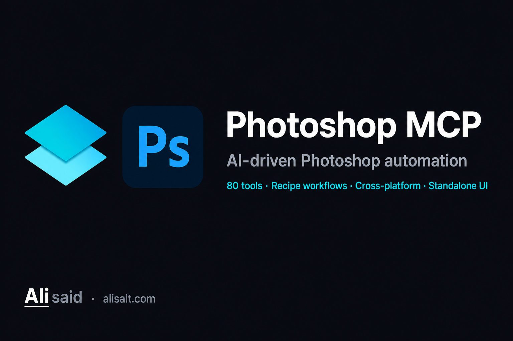

# Photoshop MCP Server

<p align="center">
  <a href="https://github.com/alisaitteke/photoshop-mcp">
    
  </a>
</p>

_Recipe workflows reduce round-trips and make Photoshop automation more reliable._

> **Note:** This is an unofficial, community-maintained project and is not affiliated with or endorsed by Adobe Inc.

[](https://www.npmjs.com/package/@alisaitteke/photoshop-mcp)
[](https://github.com/alisaitteke/photoshop-mcp/releases)
[](https://opensource.org/licenses/MIT)
[](https://www.typescriptlang.org/)
[]()

A Model Context Protocol (MCP) server that enables AI assistants like Claude and Cursor to control Adobe Photoshop programmatically. Create designs, manipulate images, and automate Photoshop workflows through natural-language commands from an MCP-capable host.

## Why this exists

Designers and developers want to drive Photoshop from AI assistants, but raw ExtendScript calls are brittle: agents waste tokens on trial-and-error, layer types break filters, and one failed command leaves the document in an unknown state.

Photoshop MCP adds **state awareness** (`get_state`, `get_preview`, `get_capabilities`), **recipe tools** that wrap multi-step outcomes in a single undo step, and **structured error envelopes** so agents know what to try next.

Engineering deep-dive: [`docs/architecture.md`](docs/architecture.md).

## Standalone browser UI (security-disabled)

The `photoshop-mcp-ui` compatibility command is intentionally disabled. It
always fails closed and starts no listener, browser, analytics identity, or
database work. It will remain unavailable until authenticated pairing and TLS
are implemented. The `web/` source and its build remain in the repository, but
are not a supported path to the privileged Photoshop API.

---

## AI/Prompt Layer for Photoshop

On top of atomic `photoshop_*` tools, the server ships an opinionated AI/prompt
layer that helps host LLMs (Cursor, Claude Desktop, etc.) translate vague user
requests into reliable Photoshop actions:

- **Server `instructions`** — workflow contract advertised on MCP `initialize`
  (ping once, state-before-action, prefer recipes, error recovery). See
  [`src/prompts/instructions.ts`](src/prompts/instructions.ts).
- **MCP `prompts` primitive** — 18 pre-engineered templates (11 recipe + 7 guide:
  `ps.enhance_portrait`, `ps.remove_background`, `ps.generative_fill`, …)
  via `prompts/list` and `prompts/get`.
- **Recipe tools** — 11 outcome-oriented `photoshop_recipe_*` tools (remove
  background, enhance portrait, export social variants, color
  grade, frequency separation, batch mockup, organize layers, gradient fade,
  sky blend, dodge & burn, remove distraction). Each wraps steps in a single
  Photoshop history state (one Undo reverts all). **85 tools total**, including
  **11 recipe tools**.
- **Generative AI** — `photoshop_generative_fill`, `photoshop_generative_remove`,
  `photoshop_generative_expand`, `photoshop_generative_upscale`, `photoshop_sky_replacement`,
  `photoshop_generate_image` (Firefly via ExtendScript; Adobe account + credits required).
- **Neural Filters** — `photoshop_neural_filter` via optional UXP bridge plugin (`uxp-plugin/`).
- **State & preview** — `photoshop_get_state` (cheap snapshot),
  `photoshop_get_preview` (base64 JPEG for vision verification),
  `photoshop_get_capabilities` (version-aware feature flags).
- **Structured errors** — failures return JSON envelopes with `code` and
  `suggested_next_tool` for self-correction.

Full reference: [`docs/prompt-layer.md`](docs/prompt-layer.md).

Verify parity: `npm run verify:photoshop-prompts`. Latest results:
[`docs/development.md#integration-test-results`](docs/development.md#integration-test-results).

## Example Prompts

Below are example prompts you can use with AI assistants (Claude, Cursor, etc.)
when this MCP server is configured. Prefer **recipe tools** (`photoshop_recipe_*`)
for multi-step outcomes — each recipe is a single undo step. Use atomic
`photoshop_*` tools only for fine-grained edits no recipe covers.

<details>
<summary>🧠 State-aware session (recommended first step)</summary>

```
Ping Photoshop and read capabilities for my installed version.
Get the current document state before changing anything.
Open portrait.jpg, get a downscaled preview so you can verify the subject.
After each major recipe, get another preview to confirm the result.
```

</details>

<details>
<summary>👤 Portrait retouch (recipe)</summary>

```
Enhance the portrait on the active layer at medium intensity with skin smoothing.
Use the enhance-portrait recipe — I want frequency separation + auto-tone in one undoable step.
If the active layer is text or a Smart Object, rasterize first or pick a raster layer.
Show me a preview when done.
```

Equivalent MCP prompt template: `ps.enhance_portrait` with `{ intensity: "medium", skin_smoothing: "true" }`.

</details>

<details>
<summary>✂️ Background removal (recipe)</summary>

```
Remove the background from the active portrait layer.
Use Select Subject + a layer mask with a 2px feather. Keep the original pixels behind the mask.
The subject must be on the active layer — not a flat color fill.
```

Equivalent MCP prompt template: `ps.remove_background` with `{ feather_px: "2", keep_shadow: "false" }`.

</details>

<details>
<summary>🎨 Color grade (recipe)</summary>

```
Apply a warm film color grade to the open document as non-destructive adjustment layers.
Use the apply-color-grade recipe with preset warm_film.
Preview the result when finished.
```

</details>

<details>
<summary>🔬 Frequency separation setup (recipe)</summary>

```
Set up frequency separation on the active raster layer with a 6px blur radius.
I will paint on the Low and High layers myself — do not apply extra smoothing.
Tell me which layers to edit when the stack is ready.
```

Equivalent MCP prompt template: `ps.frequency_separation` with `{ radius_px: "6" }`.

</details>

<details>
<summary>🌐 Social export (recipe)</summary>

```
Export Instagram post and X post variants as separate JPEGs from the active document.
List the output paths in a table.
```

Equivalent template: `ps.export_social_variants`.

</details>

<details>
<summary>📦 Batch mockup replace (recipe)</summary>

```
I have a mockup PSD open with a Smart Object layer named "Screen".
Replace it with every PNG/JPG in ~/assets/mockups/ and export one JPEG per asset.
Do not place flat layers — swap the Smart Object so perspective is preserved.
```

Equivalent MCP prompt template: `ps.batch_mockup_replace`.

</details>

<details>
<summary>🗂️ Organize layers (recipe)</summary>

```
Organize the layer stack: rename by kind, auto-group related layers, preserve originals.
Run the organize-layers recipe, then list layers so I can review the new structure.
```

</details>

<details>
<summary>🎨 Basic Design Creation</summary>

```
Create a 1920x1080 Photoshop document with RGB color mode.
Add a light blue background layer and fill it with RGB(240, 248, 255).
Add centered text "Welcome" in 64pt font.
Save as welcome.psd to my Desktop.
```

</details>

<details>
<summary>🖼️ Stock Image Design (with Pexels MCP)</summary>

```
Search Pexels for "mountain sunset" images.
Create a 1920x1080 Photoshop document.
Place the downloaded image and fit it to fill the entire canvas.
Apply a subtle Gaussian blur of 3px.
Increase brightness by 15 and contrast by 10.
Add white text "Adventure Awaits" centered at the top in 72pt.
Set the text opacity to 90% and blend mode to OVERLAY.
Save as adventure.jpg with quality 10.
```

</details>

<details>
<summary>✨ Photo Enhancement</summary>

```
Open photo.jpg from my Desktop in Photoshop.
Get state, then run the enhance-portrait recipe at low intensity.
If I only need quick tone fixes, apply auto levels, auto contrast, and unsharp mask (120%, 1.5, 0) on the active layer instead.
Adjust hue +15 and saturation +15, then use the supported social-export recipe when I'm ready to export.
Save as enhanced-photo.jpg with quality 12.
```

</details>

<details>
<summary>🎭 Layer Effects & Blending</summary>

```
Create a 1200x800 document.
Add a new layer named "Background" and fill with RGB(50, 50, 50).
Place logo.png at position (100, 100).
Fit the logo layer to 50% of its current size.
Set blend mode to SCREEN and opacity to 85%.
Add another layer, fill with RGB(255, 100, 50).
Set this layer's blend mode to MULTIPLY and opacity to 60%.
Merge all visible layers.
Save as composite.psd.
```

</details>

<details>
<summary>📝 Text Poster Design</summary>

```
Create a 1080x1350 portrait document (Instagram story size).
Add a layer and fill with gradient-like color RGB(120, 40, 200).
Add text "SUMMER" at (540, 300) in 96pt.
Change text color to white RGB(255, 255, 255).
Set text alignment to CENTER.
Add another text "2026" at (540, 450) in 128pt, white color.
Apply Gaussian blur 2px to the background layer.
Save as summer-poster.png.
```

</details>

<details>
<summary>🎬 Batch Processing</summary>

```
Open image1.jpg.
Resize to 1920x1080.
Apply auto contrast.
Apply subtle sharpen (amount 80%, radius 1.0).
Save as processed-1.jpg with quality 10.
Close without saving changes to original.

Repeat for image2.jpg and image3.jpg.
```

</details>

<details>
<summary>🖌️ Creative Manipulation</summary>

```
Create a 2000x2000 square document.
Place abstract-pattern.jpg and fit to fill document.
Duplicate the layer.
On the duplicate, apply motion blur at 45 degrees, radius 50px.
Set blend mode to OVERLAY and opacity to 70%.
Add centered text "MOTION" in 120pt white.
Apply a rectangular selection from (200, 200) to (1800, 1800).
Invert the selection and delete (to create a border effect).
Flatten the image.
Save as motion-art.jpg.
```

</details>

<details>
<summary>🎯 Advanced Workflow</summary>

```
Create a 3000x2000 document at 300 DPI for print.
Place hero-image.jpg and fit to fill the canvas.
Duplicate the image layer.
On the duplicate, desaturate it completely.
Set blend mode to LUMINOSITY and opacity to 50%.
Create a new layer named "Overlay".
Fill with RGB(255, 150, 0) and set blend mode to SOFTLIGHT at 30% opacity.
Add text "PORTFOLIO" at top center (1500, 200) in 96pt.
Set text color to white.
Add subtext "2026 Collection" at (1500, 320) in 36pt.
Create a rectangular selection around the text area.
Create a layer mask on the overlay layer.
Merge visible layers.
Save as portfolio-cover.psd.
Export as portfolio-cover.jpg at quality 12.
```

</details>

<details>
<summary>🔄 Using Actions</summary>

```
Open my-photo.jpg.
Play the "Vintage Look" action from "My Actions" set.
Adjust brightness by -10 to darken slightly.
Save as vintage-photo.jpg.
```

</details>

<details>
<summary>⏮️ Undo/Redo Operations</summary>

```
Apply Gaussian blur 15px to the active layer.
[Wait for result]
Actually, that's too much blur. Undo that.
Apply Gaussian blur 5px instead.
```

Or:

```
Get the history states to see what operations were performed.
Undo the last 3 operations.
Redo 1 step to bring back one operation.
```

</details>

<details>
<summary>🔁 Error recovery (structured envelopes)</summary>

```
If a recipe returns version_unsupported or generative_unavailable, call get_capabilities and tell me which Photoshop feature is missing.
If a tool fails with suggested_next_tool, follow that hint (e.g. rasterize_layer before a raster-only recipe).
Never guess — read get_state after a failure and propose the next single step.
```

</details>

## Features

- **Standalone browser UI security boundary** — `photoshop-mcp-ui` is retained as
  a clear failing compatibility command until authenticated pairing and TLS exist
- **Windows full automation** via ExtendScript/COM; **macOS optional UXP bridge** for supported UXP commands
- **Supports Photoshop 2012-2026+** (UXP bridge requires Photoshop 26+)
- **ExtendScript API**: Windows COM automation; macOS ExtendScript execution is security-disabled
- **Auto-Detection**: Automatically finds Photoshop installation on your system
- **85 Tools**: including 11 outcome-oriented `photoshop_recipe_*` tools
- **AI/Prompt Layer**: 18 MCP prompt templates (11 recipe + 7 guide), server instructions, state/preview/capabilities tools
- **Document Management**: Create, open, save, close, crop documents
- **Layer Operations**: Create, delete, duplicate, merge, transform layers
- **Layer Properties**: Opacity, blend modes, visibility, locking
- **Text Formatting**: Font, size, color, alignment controls
- **Image Placement**: Place images, open files, fit to document
- **Filters**: Gaussian Blur, Sharpen, Noise, Motion Blur
- **Color Adjustments**: Brightness/Contrast, Hue/Saturation, Curves, Auto Levels/Contrast
- **Selections & Masks**: Rectangular selections, select subject, content-aware fill, gradient mask, layer masks
- **History Control**: Undo/Redo operations, view history states
- **Actions**: Play recorded actions. Arbitrary caller-supplied scripts are intentionally unavailable for security; use supported atomic tools or recipes instead.
- **Auto-Rasterize**: Automatically converts layers when needed for filters
- **Context Tracking**: Returns document/layer state after each operation for AI context awareness

## Installation

### Using NPX (Recommended)

No installation required! Just configure your MCP client:

```bash
npx @alisaitteke/photoshop-mcp
```

To hack on the repo locally, see [From Source](docs/development.md#from-source) in the development guide.

## Configuration

### For Cursor

Add to your Cursor settings (`.cursor/config.json` or workspace settings):

```json
{
  "mcpServers": {
    "photoshop": {
      "command": "npx",
      "args": ["-y", "@alisaitteke/photoshop-mcp"],
      "env": {
        "LOG_LEVEL": "1"
      }
    }
  }
}
```

### For Claude Desktop

Add to your Claude Desktop config (`~/Library/Application Support/Claude/claude_desktop_config.json` on macOS or `%APPDATA%\Claude\claude_desktop_config.json` on Windows):

```json
{
  "mcpServers": {
    "photoshop": {
      "command": "npx",
      "args": ["-y", "@alisaitteke/photoshop-mcp"],
      "env": {
        "LOG_LEVEL": "1"
      }
    }
  }
}
```

### Environment Variables

- `PHOTOSHOP_PATH`: (Optional) Specify custom Photoshop installation path
- `LOG_LEVEL`: Logging level (0=DEBUG, 1=INFO, 2=WARN, 3=ERROR)
- `ANALYTICS_DISABLED`: Set to `1` or `true` to disable anonymous usage analytics entirely
- `POSTHOG_DISABLED`: Legacy alias for `ANALYTICS_DISABLED`
- `ANALYTICS_PROVIDER`: Analytics backend — `mixpanel` (default) or `posthog` (rollback)
- `MIXPANEL_TOKEN`: (Optional) Override the Mixpanel project token
- `MIXPANEL_API_HOST`: (Optional) Mixpanel ingest host (default: `https://api-eu.mixpanel.com`)
- `POSTHOG_KEY`: (Optional, legacy) PostHog project key — used only when `ANALYTICS_PROVIDER=posthog`
- `POSTHOG_API_HOST`: (Optional, legacy) PostHog ingest host (default: `https://a.alisait.com`)
- `POSTHOG_UI_HOST`: (Optional, legacy) PostHog UI host (default: `https://eu.posthog.com`)

## Available Tools

Full reference for all atomic `photoshop_*` tools (parameters, examples, and usage):
[`docs/available-tools.md`](docs/available-tools.md).

## Context Tracking

Each tool returns comprehensive context information about the current state of Photoshop, including:

- **Document Info**: Name, dimensions, resolution, color mode, layer count
- **Active Layer Info**: Name, type, opacity, blend mode, visibility, lock state
- **Selection State**: Whether a selection is active
- **Operation Result**: Specific details about what was changed

This allows AI assistants to maintain awareness of:

- Which document is active
- Which layer is being worked on
- Current layer properties (opacity, blend mode, etc.)
- Document dimensions and settings

**Example Response:**

```javascript
{
  "applied": true,
  "filter": "Gaussian Blur",
  "radius": 10,
  "wasRasterized": true,
  "context": {
    "hasDocument": true,
    "document": {
      "name": "design.psd",
      "width": 1920,
      "height": 1080,
      "resolution": 72,
      "colorMode": "RGBColorMode",
      "layerCount": 3,
      "hasSelection": false
    },
    "activeLayer": {
      "name": "Background",
      "kind": "NORMAL",
      "opacity": 100,
      "blendMode": "NORMAL",
      "visible": true,
      "locked": false,
      "isBackground": false
    }
  }
}
```

This context helps AI assistants remember what document and layer they're working on across multiple commands.

---

## Platform-Specific Notes

### Windows

- Uses COM automation to communicate with Photoshop
- Registry-based auto-detection for installation paths
- Supports both 32-bit and 64-bit versions

### macOS

- Spotlight-based auto-detection
- ExtendScript execution is security-disabled; load the optional authenticated UXP bridge for supported UXP commands

## Supported Photoshop Versions

- **Windows Photoshop 2012-2026+**: Uses ExtendScript API via COM automation
- **macOS Photoshop 26+**: Optional authenticated UXP bridge for supported UXP commands; direct ExtendScript execution is unavailable

**Important Note**: UXP commands require the companion plugin. The macOS direct
script-execution path is intentionally unavailable pending a reviewed replacement
transport.

## Troubleshooting

Common connection, scripting, and logging issues:
[`docs/troubleshooting.md`](docs/troubleshooting.md).

## Development

From-source setup, build, lint, integration tests (with latest results), and usage examples:
[`docs/development.md`](docs/development.md).

## Architecture

System design, data flow, platform abstraction, and UI agent modes:
[`docs/architecture.md`](docs/architecture.md).

Sharing on LinkedIn or social? Use [`images/og-social.png`](images/og-social.png) and
[`docs/social-preview.md`](docs/social-preview.md) for OG setup and post copy.

## Contributing

Contributions are welcome! Please read [CONTRIBUTING.md](CONTRIBUTING.md) before opening a PR.

## About the maintainer

**[Ali Sait Teke](https://alisait.com)** — Full-Stack engineer & AI-era software architect
(Python, Go, Node.js, React, Next.js, Vue).

This project started from a practical question: _how do you make Photoshop reliably
controllable by LLMs without fragile one-off scripts?_ It grew into an MCP server
with 85 tools, 11 recipes, and 18 prompts for dependable multi-step workflows.

**What this codebase demonstrates:** TypeScript systems design, MCP protocol
integration, Windows COM automation plus an authenticated macOS UXP bridge, and
structured error recovery for agentic loops.

- [Portfolio](https://alisait.com) · [GitHub](https://github.com/alisaitteke) · [LinkedIn](https://www.linkedin.com/in/alisait/)

## License

MIT

## Anonymous Usage Analytics

Anonymous, aggregated usage events are collected by default to improve the
product. You can opt out at any time. Full details:
[`docs/anonymous-usage-analytics.md`](docs/anonymous-usage-analytics.md).

## Acknowledgments

- Built with the [Model Context Protocol SDK](https://github.com/modelcontextprotocol/sdk)
- Inspired by the Adobe Photoshop scripting community
