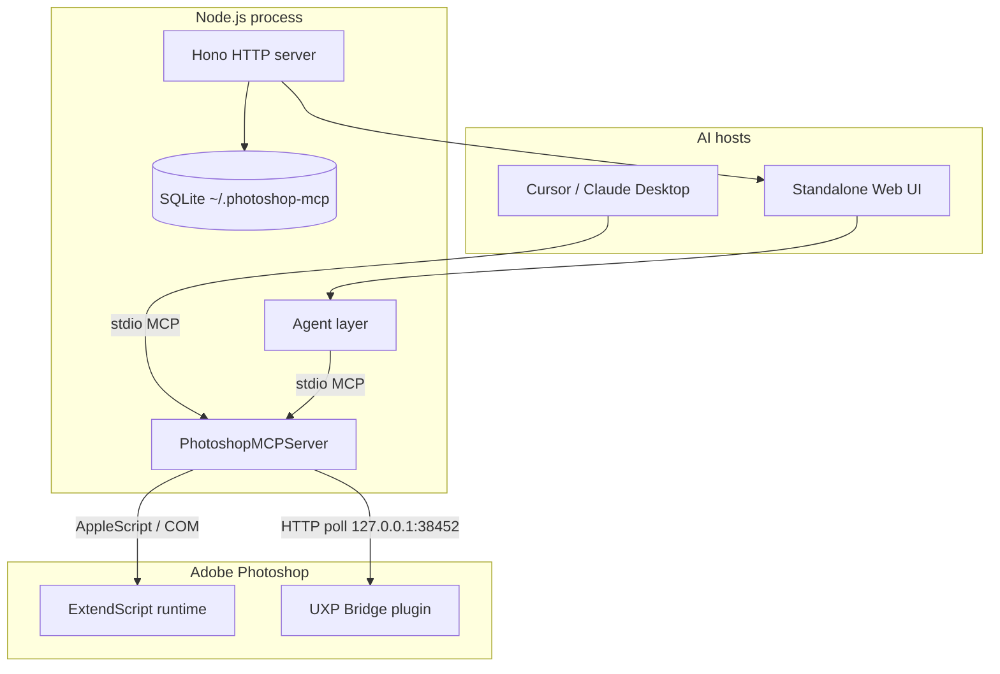

# Architecture

Engineering overview of **Photoshop MCP** — how AI assistants reach Adobe Photoshop reliably across macOS and Windows.

← Back to [README](../README.md)

**Maintainer:** [Ali Sait Teke](https://alisait.com) · [GitHub](https://github.com/alisaitteke) · [LinkedIn](https://www.linkedin.com/in/alisait/)

---

## System overview

The project is a **local-first bridge** between MCP-capable AI hosts (Cursor, Claude Desktop, or the bundled web UI) and a running Photoshop instance. Nothing runs in the cloud: the MCP server, UI, credentials, and exports all stay on the user's machine.



| Layer | Responsibility | Key paths |
| ----- | -------------- | --------- |
| **MCP core** | Tool/prompt registry, session, MCP protocol | `src/core/` |
| **Platform** | Photoshop detection, script execution | `src/platform/` |
| **Tools** | 74 atomic + 12 recipe MCP tools (+ generative & neural) | `src/tools/` |
| **Prompt layer** | Server instructions, 19 MCP prompt templates | `src/prompts/` |
| **Errors** | Structured envelopes for agent self-correction | `src/errors/envelope.ts` |
| **Standalone UI** | Hono API, multi-provider agent, chat persistence | `src/ui/`, `web/` |
| **Analytics** | Opt-out anonymous usage (Mixpanel / PostHog) | `src/analytics/` |

---

## MCP server (`src/core/`)

`PhotoshopMCPServer` wires the official MCP SDK with:

- **86 tools** registered via `ToolRegistry` (atomic operations + outcome-oriented recipes + generative/neural AI).
- **19 prompts** via `PromptRegistry` (`prompts/list`, `prompts/get`).
- **Server instructions** on `initialize` — workflow contract for host LLMs (state-before-action, prefer recipes, error recovery). See [`src/prompts/instructions.ts`](../src/prompts/instructions.ts).
- **Structured error wrapping** — every tool handler passes through `wrapToolHandler` so failures return JSON with `code` and `suggested_next_tool` for agentic repair loops.

Entry point: [`src/index.ts`](../src/index.ts) → stdio transport.

---

## Platform abstraction (`src/platform/`)

Photoshop has no stable HTTP API for external automation. This server uses **ExtendScript** executed through platform-specific bridges:

| OS | Detection | Execution |
| -- | --------- | --------- |
| **macOS** | Spotlight / app bundle paths (`macos-detector.ts`) | AppleScript → `do javascript` (`macos-executor.ts`) |
| **Windows** | Registry (`windows-detector.ts`) | COM automation (`windows-executor.ts`) |

`connection.ts` manages the lifecycle: find Photoshop, verify responsiveness, route scripts.

**Design decision:** ExtendScript remains the default external automation path for **Photoshop 2012–2026+** on both platforms. **Generative Fill / Remove / Expand** run via ExtendScript `executeAction` with extended timeouts. **Neural Filters** require the optional **UXP bridge** (`uxp-plugin/` + MCP-hosted poll server on `127.0.0.1:38452`) because `batchPlay` is only available inside a UXP plugin.

ExtendScript snippets live in [`src/api/extendscript.ts`](../src/api/extendscript.ts); tools compose them rather than embedding raw strings inline.

---

## Tool model

### Atomic tools (`photoshop_*`)

Fine-grained operations: documents, layers, filters, masks, text, history, state/preview/capabilities. Each successful call returns **context** (active document, layer, selection) so the host LLM stays oriented across turns.

### Recipe tools (`photoshop_recipe_*`)

Multi-step workflows wrapped in a **single Photoshop history state** — one Undo reverts the entire recipe. Examples: `enhance_portrait`, `remove_background`, `prepare_for_web`, `batch_mockup_replace`.

Recipes reduce token burn and failure modes versus chaining many atomic calls without state awareness.

Full prompt-layer mapping: [`docs/prompt-layer.md`](prompt-layer.md).

---

## Standalone web UI

Shipped in the same npm package (`photoshop-mcp-ui` bin). Stack:

| Concern | Choice |
| ------- | ------ |
| Frontend | Vue 3, Tailwind v4, shadcn-vue |
| Backend | Hono on Node (`src/ui/server.ts`) |
| Persistence | better-sqlite3 at `~/.photoshop-mcp/data.db` |
| LLM (API key) | Vercel AI SDK — Anthropic, OpenAI, Google, OpenRouter |
| LLM (CLI account) | Claude Agent SDK / Gemini CLI headless |
| Photoshop | Same MCP server over stdio (`src/ui/agent/mcp-transport.ts`) |

### Agent modes

1. **Default (ReAct)** — model calls tools iteratively; `src/ui/agent/api-key.ts` and provider-specific CLI paths.
2. **Action Plan (beta)** — one planning LLM call produces an ordered tool list; direct execution with bounded repair (`src/ui/agent/action-plan.ts`). Fewer round-trips for multi-step prompts.

The UI restricts the agent to **Photoshop MCP tools only** — no shell, filesystem, or web tools from the host.

---

## Error recovery contract

[`src/errors/envelope.ts`](../src/errors/envelope.ts) classifies ExtendScript/runtime failures into typed codes (`no_active_document`, `version_unsupported`, `generative_unavailable`, …) and suggests the next tool (`photoshop_get_state`, `photoshop_get_capabilities`, etc.).

This is intentional **agent UX design**: hosts can self-correct without guessing, which matters when non-technical users drive Photoshop through natural language.

---

## Repository layout

```
photoshop-mcp/
├── src/
│   ├── core/              # MCP server, registries, session
│   ├── platform/          # macOS / Windows detection & execution
│   ├── api/               # ExtendScript library
│   ├── tools/             # Atomic + recipe MCP tools
│   ├── prompts/           # Instructions + prompt templates
│   ├── errors/            # Structured error envelopes
│   ├── analytics/         # Anonymous usage telemetry
│   └── ui/                # Standalone UI server, agent, providers, store
├── web/                   # Vue SPA (built to web/dist, bundled in npm)
├── docs/                  # Architecture, development, prompt layer, …
├── images/                # README screenshots, OG social preview
├── uxp-plugin/            # Optional UXP bridge for Neural Filters
└── scripts/               # Integration tests, spike probes, release tooling
```

---

## Design principles

1. **Local-first** — API keys and OAuth tokens stay on disk; Photoshop runs locally.
2. **State before action** — `photoshop_get_state` / `get_preview` / `get_capabilities` cheapen verification and vision checks.
3. **Recipes over atomic chains** — fewer LLM turns, one undo per outcome.
4. **Cross-platform parity** — same tool surface on macOS and Windows; platform quirks isolated in `src/platform/`.
5. **Swappable AI providers** — registry pattern in `src/ui/providers/`; custom OpenAI-compatible endpoints supported.
6. **Observable, not invasive** — analytics are anonymous and opt-out (`ANALYTICS_DISABLED=1`).

---

## Related docs

- [Prompt layer](prompt-layer.md) — instructions, templates, recipes
- [Available tools](available-tools.md) — full `photoshop_*` reference
- [Development](development.md) — build, test, from-source setup
- [Troubleshooting](troubleshooting.md) — connection and scripting issues

---

## About the maintainer

**Ali Sait Teke** — Full-Stack engineer and AI-era software architect (Python, Go, Node.js, React, Next.js, Vue).

This project demonstrates end-to-end systems work: MCP protocol integration, cross-platform desktop automation, structured error design for LLM agents, and a production-minded local UI — built as open source for the creative-automation and developer-tools community.

- **Portfolio:** [alisait.com](https://alisait.com)
- **GitHub:** [github.com/alisaitteke](https://github.com/alisaitteke)
- **LinkedIn:** [linkedin.com/in/alisait](https://www.linkedin.com/in/alisait/)
