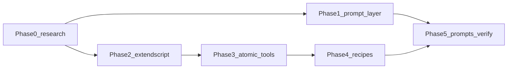

# Prompt Intent Expansion

Expand the Photoshop MCP prompt layer so host LLMs map colloquial user language (blogs, Reddit, natural chat) to the correct `photoshop_recipe_*` / `photoshop_*` tools. Full stack: intent glossary, guide prompts, ExtendScript primitives, new recipes, verification.

## Baseline → target

| Layer | Baseline (today) | After Phase 5 | Anchor |
|-------|------------------|---------------|--------|
| Atomic tools | 55 | **59** (+4 core) | `src/core/server.ts:106-121` |
| Recipe tools | 8 | 12 | `src/tools/recipes/index.ts:25-34` |
| Recipe prompts | 8 | 12 | `src/prompts/registry.ts:12-21` |
| Guide prompts | 0 | 4 | Phase 1 (`ps.gradient_blend`, etc.) |
| Instructions | bootstrap + recipe list | + glossary, degrade paths, disambiguation | `src/prompts/instructions.ts:5-64` |
| ExtendScript snippets | none for Tier A gaps | curves, gradient mask, select subject, content-aware (+ generative if spike OK) | `src/api/extendscript.ts:86+` |
| Verify linter | strict 8↔8 recipe parity | 12↔12 recipes + separate guide list | `scripts/verify-photoshop-prompt-coverage.ts:44-80` |

**Next step:** Phase 5 complete — see [phase-5-handoff.md](./phase-5-handoff.md).

## Phases

| Phase | File | Layer | Status |
|-------|------|-------|--------|
| 0 | [phase-0-research.md](./phase-0-research.md) | research / spike | **Done** — [handoff](./phase-0-handoff.md) |
| 1 | [phase-1-prompt-layer.md](./phase-1-prompt-layer.md) | prompt-layer | **Done** — [handoff](./phase-1-handoff.md) |
| 2 | [phase-2-extendscript.md](./phase-2-extendscript.md) | extendscript API | **Done** — [handoff](./phase-2-handoff.md) |
| 3 | [phase-3-atomic-tools.md](./phase-3-atomic-tools.md) | mcp-tools | **Done** — [handoff](./phase-3-handoff.md) |
| 4 | [phase-4-recipes.md](./phase-4-recipes.md) | recipes | **Done** — [handoff](./phase-4-handoff.md) |
| 5 | [phase-5-prompts-verify.md](./phase-5-prompts-verify.md) | prompts + verify + docs | **Done** — [handoff](./phase-5-handoff.md) |

Handoff docs (`phase-N-handoff.md`) are written by the implementing agent after each phase completes.

## Confirmed decisions

| Decision | Value |
|----------|-------|
| Backward compatibility | **No** strict compat on prompt/instruction/description **text** — may rewrite aggressively. Existing 55 atomic + 8 recipe **tool names and input schemas** stay unchanged. New tools/recipes are **additive**. |
| Scope | **Full stack** — prompts + ExtendScript + atomics + recipes + verification. |
| Dev platform | **macOS** (ExtendScript spike runs on user's machine). |
| Scripting API | External MCP uses **ExtendScript only** — `UXPPhotoshopAPI` is not available for AppleScript/COM (`src/api/photoshop-api.ts:48-51`). |
| Prompt parity model | **Recipe prompts** stay 1:1 with `photoshop_recipe_*`. **Guide prompts** (`ps.gradient_blend`, etc.) are registered separately — not in `RECIPE_TO_PROMPT`. |
| Generative AI tools | **Gated on Phase 0 spike** — include only if `executeAction` descriptors work; else content-aware fallback + user handoff. |

## Dependency order

## Popular topics (research summary)

Tier A gaps (implement first): gradient mask blending, sky replacement, object/distraction removal, portrait/dodge-burn vocabulary, curves adjustment.

See [intent-taxonomy.md](./intent-taxonomy.md) (produced in Phase 0) for phrase → tool mapping.

## Reference plans in this repo

No `docs/plans/session-status-timeline/` exists yet in this repo; this folder establishes the convention for photoshop-mcp.
